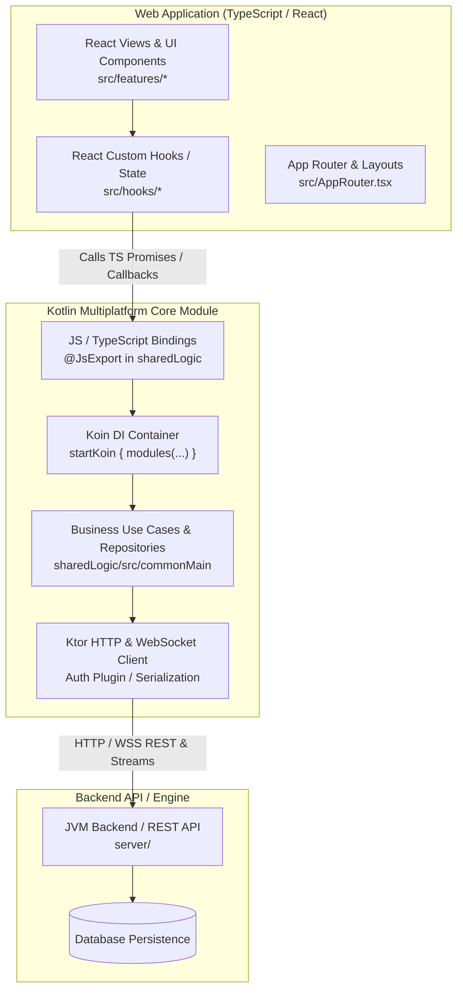

# Kotlin Multiplatform (KMP) & Web Application Architecture Guide

This document provides a detailed architecture and developer guide for integrating a **Kotlin Multiplatform (KMP) Shared Core** with a **TypeScript / React Web Application**. It outlines how data flows between layers, how interop is configured, layer separation guidelines, and debugging protocols for KMP web applications.

---

## 1. System Architecture & Data Flow

Modern multiplatform applications use a **Shared Core Architecture**. Business logic, API clients, serialization, data storage, and state management reside in Kotlin (`commonMain`) and compile directly into native/JS targets for Web, Android, and iOS.



---

## 2. Linking the Web App with Shared KMP Logic

### A. KMP Gradle JS Configuration (`sharedLogic/build.gradle.kts`)
The KMP shared module configures a JS browser target with TypeScript definition generation (`.d.ts`):

```kotlin
kotlin {
    js {
        outputModuleName = "sharedLogic"
        browser()
        binaries.library()
        generateTypeScriptDefinitions()
        compilerOptions {
            target = "es2015"
            optIn.add("kotlin.js.ExperimentalJsExport")
        }
    }
}
```

### B. NPM Local Package Linking (`webApp/package.json`)
The React web application links to the local Gradle JS output directory as a package dependency:

```json
{
  "name": "webApp",
  "dependencies": {
    "sharedLogic": "file:../../../sharedLogic",
    "react": "^18.2.0",
    "react-router-dom": "^7.0.0"
  }
}
```

---

## 3. Strict Separation of Concerns

To maintain long-term maintainability and multiplatform compatibility, enforce strict architectural boundaries:

| Layer | Location | Responsibilities | STRICT PROHIBITIONS |
| :--- | :--- | :--- | :--- |
| **UI Layer** | `webApp/src/` | • Rendering React UI components<br/>• Design system tokens & CSS styling<br/>• User input & event handling | ❌ Direct `fetch()` or `axios` HTTP calls<br/>❌ Domain calculations or validation logic<br/>❌ Direct manipulation of raw auth tokens |
| **Domain Layer** | `sharedLogic/src/commonMain/` | • Business models & data classes<br/>• Ktor REST & WebSocket client calls<br/>• Domain validation & state managers<br/>• Auth tokens & persistent store | ❌ DOM / React-specific dependencies<br/>❌ Hardcoded HTML or styling strings |
| **Backend Layer**| `server/` | • Database persistence & migrations<br/>• Route handling & API validation<br/>• Authentication verification | ❌ Client-side rendering code |

---

## 4. Async Data Flow & Interop (Kotlin $\leftrightarrow$ TypeScript)

### A. Kotlin `suspend` Functions $\rightarrow$ TypeScript Promises
Kotlin `suspend` functions annotated with `@JsExport` automatically compile to JavaScript `Promise` objects.

```kotlin
// Kotlin (sharedLogic/commonMain)
@OptIn(ExperimentalJsExport::class)
@JsExport
class ItemRepository(private val client: HttpClient) {
    suspend fun fetchItemDetails(id: String): ItemModel {
        return client.get("/api/items/$id").body()
    }
}
```

```tsx
// React (webApp)
useEffect(() => {
  repository.fetchItemDetails(itemId)
    .then((data) => setItem(data))
    .catch((err) => setError(err.message));
}, [itemId]);
```

### B. Reactive Flows $\rightarrow$ JavaScript Callbacks
For real-time streams (e.g. WebSockets, active telemetry), export a subscription listener in Kotlin:

```kotlin
// Kotlin (sharedLogic/commonMain)
@OptIn(ExperimentalJsExport::class)
@JsExport
class RealtimeStream(private val client: HttpClient) {
    fun subscribe(onMessage: (MessageModel) -> Unit): CancellationHandle {
        val job = CoroutineScope(Dispatchers.Default).launch {
            // Collect flow and trigger JS callback
        }
        return CancellationHandle { job.cancel() }
    }
}
```

---

## 5. Dependency Injection & Auth Token Pipeline

### A. Koin Dependency Injection
Dependencies (HTTP clients, repositories, use cases) are registered in Koin modules within `commonMain`:

```kotlin
val sharedModule = module {
    single { HttpClient { install(ContentNegotiation) { json() } } }
    single { AuthRepository(get()) }
    single { ItemRepository(get()) }
}
```

### B. Encapsulated Auth Token Pipeline
1. The user logs in via `AuthRepository.login(credentials)`.
2. The authentication token (JWT) is stored internally in `sharedLogic`.
3. The Ktor Client automatically attaches `Authorization: Bearer <token>` to outgoing requests via the Ktor `Auth` plugin.
4. React components call high-level domain functions and **never touch raw access tokens**.

---

## 6. Step-by-Step Guide: Adding a New Feature

When building a new feature (e.g., *User Review System*):

### Step 1: Define Data Models & Use Cases in Kotlin (`commonMain`)
Create data classes and logic in `sharedLogic/src/commonMain/kotlin/`:

```kotlin
@OptIn(ExperimentalJsExport::class)
@JsExport
@Serializable
data class SubmitReviewRequest(
    val entityId: String,
    val rating: Int,
    val comment: String
)

@OptIn(ExperimentalJsExport::class)
@JsExport
class ReviewRepository(private val httpClient: HttpClient) {
    suspend fun submitReview(request: SubmitReviewRequest): Boolean {
        return httpClient.post("/api/reviews") { setBody(request) }.status.isSuccess()
    }
}
```

### Step 2: Recompile Shared Logic
Build the Kotlin module to update JS artifacts and TypeScript definitions:
```bash
./gradlew :sharedLogic:build
```

### Step 3: Consume in React (`webApp`)
Import generated TypeScript definitions into your component:

```tsx
import React, { useState } from 'react';
import { SubmitReviewRequest, ReviewRepository } from 'sharedLogic';

export const ReviewForm: React.FC<{ entityId: string }> = ({ entityId }) => {
  const [comment, setComment] = useState('');

  const handleSubmit = async () => {
    const request = new SubmitReviewRequest(entityId, 5, comment);
    // Execute KMP repository call
  };

  return (
    <div>
      <textarea value={comment} onChange={(e) => setComment(e.target.value)} />
      <button onClick={handleSubmit}>Submit Review</button>
    </div>
  );
};
```

---

## 7. Command Quick Reference

| Action | Target Directory | Command |
| :--- | :--- | :--- |
| **Recompile KMP Shared Logic** | Root `/` | `./gradlew :sharedLogic:build` |
| **Sync JS/TS Definitions Only** | Root `/` | `./gradlew :sharedLogic:jsDevelopmentLibraryCompileSync` |
| **Start Web App (Vite Dev Server)** | `webApp/` | `npm run start` |
| **Verify Web App Production Build** | `webApp/` | `npm run build` |
| **Run KMP Unit Tests** | Root `/` | `./gradlew :sharedLogic:allTests` |

---

## 8. Bug-Fixing & Troubleshooting Protocol

### Issue A: "Type 'X' is not exported from 'sharedLogic'" in TypeScript
- **Cause**: The Kotlin class or interface is missing `@JsExport`.
- **Solution**:
  1. Add `@OptIn(ExperimentalJsExport::class)` and `@JsExport` to the class/symbol in Kotlin.
  2. Avoid unsupported JS export features (e.g. non-exported generics or internal types).
  3. Rebuild with `./gradlew :sharedLogic:jsDevelopmentLibraryCompileSync`.

### Issue B: UI Not Updating / Stale `sharedLogic` Methods in Web App
- **Cause**: Vite / npm cache is holding an older build of `sharedLogic`.
- **Solution**:
  1. Force-rebuild shared logic: `./gradlew :sharedLogic:build --rerun-tasks`
  2. Restart Vite server in `webApp`: `npm run start`

### Issue C: WebSocket Memory Leaks on React Component Unmount
- **Cause**: A WebSocket listener opened in `sharedLogic` was not cancelled when the React component unmounted.
- **Solution**:
  - Always clean up subscriptions in `useEffect`:
    ```tsx
    useEffect(() => {
      const subscription = stream.subscribe(handleMessage);
      return () => {
        subscription.cancel(); // Close stream on unmount
      };
    }, []);
    ```

---

## 9. Developer Principles

1. ✅ **Keep domain logic in `commonMain` so Android, iOS, and Web share 100% of business rules.**
2. ✅ **Keep React components purely focused on UI rendering and styling.**
3. ✅ **Annotate exported shared models with `@JsExport` in Kotlin.**
4. ✅ **Run Gradle builds whenever KMP models or repository signatures change.**
